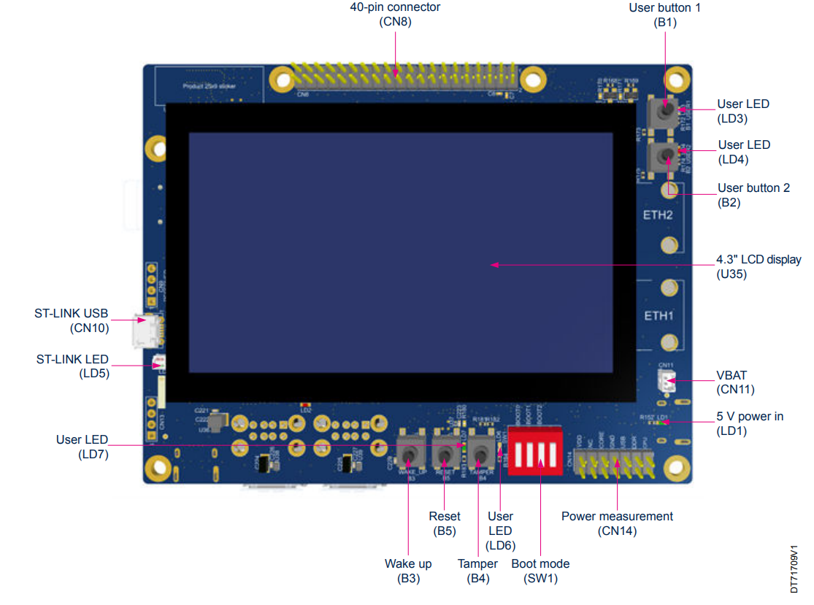

.. _stm32mp135f_dk_board:

ST STM32MP135F-DK Discovery
############################

Overview
********
The STM32MP135 Discovery kit (STM32MP135F-DK) leverages the capabilities of the
1 GHz STM32MP135 microprocessors to allow users to develop easily applications
using STM32 MPU OpenSTLinux Distribution software.

It includes an ST-LINK embedded debug tool, LEDs, push-buttons, two 10/100 Mbit/s Ethernet (RMII) connectors, one USB Type-C® connector, four USB Host Type-A connectors, and one microSD™ connector.

To expand the functionality of the STM32MP135 Discovery kit, one GPIO expansion connector is also available for third-party shields.

Additionally, the STM32MP135 Discovery kit features an LCD display with a touch panel, Wi‑Fi® and Bluetooth® Low Energy capability, and a 2-megapixel CMOS camera module.

It also provides secure boot and cryptography features.

The STM32MP157-DK2 Discovery board leverages the capacities of the STM32MP157
multi-core processor,composed of a dual Cortex®-A7 and a single Cortex®-M4 core.
Zephyr OS is ported to run on the Cortex®-M4 core.

- features:

  - STM32MP135FAF7: Arm® Cortex®-A7 32-bit processor at 1 GHz, in a TFBGA320 package
  - ST PMIC STPMIC1
  - 4-Gbit DDR3L, 16 bits, 533 MHz
  - 4.3" 480x272 pixels LCD display module with capacitive touch panel and RGB interface
  - UXGA 2-megapixel CMOS camera module (included) with MIPI CSI-2® / SMIA CCP2 deserializer
  - Wi-Fi® 802.11b/g/n
  - Bluetooth® Low Energy 4.1
  - Dual 10/100 Mbit/s Ethernet (RMII) compliant with IEEE-802.3u, one with Wake on LAN (WoL) support
  - USB Host 4-port hub
  - USB Type-C® DRP based on an STM32G0 device
  - 4 user LEDs
  - 4 push-buttons (2× user, tamper, and reset)
  - 1 wake-up button
  - Board connectors:

    - Dual-lane MIPI CSI-2® camera module expansion
    - 2x Ethernet RJ45
    - 4x USB Type-A
    - USB Micro-B
    - USB Type-C®
    - microSD™ card holder
    - GPIO expansion
    - 5 V / 3 A USB Type-C® power supply input (charger not provided)
    - VBAT for power backup

  - On-board current measurement
  - On-board STLINK-V3E debugger/programmer with USB re-enumeration capability:

    - mass storage
    - Virtual COM port
    - debug port

More information about the board can be found at the
`STM32P135 Discovery website`_.

Hardware
********

The STM32MP157 SoC provides the following hardware capabilities:

- Core:

  - 32-bit Arm® Cortex®-A7

    - L1 32-Kbyte I / 32-Kbyte D
    - 128-Kbyte unified level 2 cache
    - Arm® NEON™ and Arm® TrustZone®

    - Up to 209 MHz (Up to 703 CoreMark®)

- Memories

  - External DDR memory up to 1 Gbyte
  - up to LPDDR2/LPDDR3-1066 16-bit
  - up to DDR3/DDR3L-1066 16-bit
  - 168 Kbytes of internal SRAM: 128 Kbytes of AXI SYSRAM + 32 Kbytes of AHB SRAM and 8 Kbytes of
     SRAM in Backup domain
  - Dual Quad-SPI memory interface
  - Flexible external memory controller with up to 16-bit data bus: parallel interface to connect
    external ICs and SLC NAND memories with up to 8-bit ECC

- Security/safety

  - Secure boot, TrustZone® peripherals, 12 x tamper pins including 5 x active tampers
  - Temperature, voltage, frequency and 32 kHz monitoring

- Reset and power management

  - 1.71 V to 3.6 V I/Os supply (5 V-tolerant I/Os)
  - POR, PDR, PVD and BOR
  - On-chip LDOs (USB 1.8 V, 1.1 V)
  - Backup regulator (~0.9 V)
  - Internal temperature sensors
  - Low-power modes: Sleep, Stop, LPLV-Stop, LPLV­Stop2 and Standby
  - DDR retention in Standby mode
  - Controls for PMIC companion chip

- Clock management

  - Internal oscillators: 64 MHz HSI oscillator, 4 MHz CSI oscillator, 32 kHz LSI oscillator
  - External oscillators: 8-48 MHz HSE oscillator, 32.768 kHz LSE oscillator
  - 4 × PLLs with fractional mode

- General-purpose input/outputs

  - Up to 135 secure I/O ports with interrupt capability
  - Up to 6 wakeup

- Interconnect matrix

  - 2 bus matrices
    - 64-bit Arm® AMBA® AXI interconnect, up to 266 MHz
    - 32-bit Arm® AMBA® AHB interconnect, up to 209 MHz

- 4 DMA controllers to unload the CPU

  - 56 physical channels in total
  - 1 x high-speed general-purpose master direct memory access controller (MDMA)
  - 3 × dual-port DMAs with FIFO and request router capabilities for optimal peripheral management

- Up to 30 communication peripherals

  - 5 x I2C FM+ (1 Mbit/s, SMBus/PMBus™)
  - 4 x UART + 4 x USART (12.5 Mbit/s, ISO7816 interface, LIN, IrDA, SPI)
  - 5 x SPI (50 Mbit/s, including 4 with full-duplex I2S audio class accuracy via internal audio PLL or external clock)(+2 QUADSPI + 4 with USART)
  - 2 x SAI (stereo audio: I2S, PDM, SPDIF Tx)
  - SPDIF Rx with 4 inputs
  - 2 x SDMMC up to 8 bits (SD/e•MMC™/SDIO)
  - 2 x CAN controllers supporting CAN FD protocol
  - 2 x USB 2.0 high-speed Host
    or 1 x USB 2.0 high-speed Host+ 1 × USB 2.0 high-speed OTG simultaneously
  - 2 x Ethernet MAC/GMAC
  - IEEE 1588v2 hardware, MII/RMII/RGMII
  - 8- to 16-bit camera interface, 3 Mpix @30 fps or 5Mpix @15 fps in color or monochrome with pixel clock @120 MHz (max freq)
  - 6 analog peripherals
  - 2 x ADCs with 12-bit max. resolution up to 5 Msps

    - 1 x temperature sensor
    - 1 x digital filter for sigma-delta modulator (DFSDM) with 4 channels and 2 filters
    - Internal or external ADC reference VREF+

  - Graphics

    - LCD-TFT controller, up to 24-bit // RGB888
    - up to WXGA (1366 × 768) @60 fps or up to Full HD (1920 x 1080) @ 30 fps
    - pixel clock up to 90 MHz
    - two layers (incl. 1 secured) with programmable color LUT

  - Up to 24 timers and 2 watchdogs
  - Hardware acceleration

    - AES 128, 192, 256 DES/TDES
    - AES 128, 256 with DPA protection
    - PKA ECC/RSA with DPA protection
    - AES 128 on-the-fly DRAM encryption and decryption
    - HASH (SHA-1, SHA-224, SHA-256, SHA-384, SHA-512, SHA-3), HMAC
    - 1 x true random number generator (6 triple oscillators)
    - 1 x CRC calculation unit

- Debug mode

  - Arm® CoreSight™ trace and debug: SWD and JTAG interfaces usable as GPIOs
  - 4-Kbyte embedded trace buffer

- 3072-bit fuses including 96-bit unique ID, up to 1280 bits available for user and 256-bit HUK to protect AES 256 keys
- All packages are ECOPACK2 compliant

More information about STM32P157C can be found here:

- `STM32MP135F on www.st.com`_
- `STM32MP135F reference manual`_

Supported Features
==================

The Zephyr stm32mp157c_dk2 board configuration supports the following hardware
features:

+-----------+------------+-------------------------------------+
| Interface | Controller | Driver/Component                    |
+===========+============+=====================================+
| GVIC      | on-chip    | nested vector interrupt controller  |
+-----------+------------+-------------------------------------+
| GPIO      | on-chip    | gpio                                |
+-----------+------------+-------------------------------------+
| PINMUX    | on-chip    | pinmux                              |
+-----------+------------+-------------------------------------+

The default configuration can be found in
:zephyr_file:`boards/st/stm32mp135f_dk/stm32mp135f_dk_defconfig`

Connections and IOs
===================

STM32MP157C-DK2 Discovery Board schematic is available here:
`STM32MP135F Discovery board schematics`_.

Default Zephyr Peripheral Mapping:
----------------------------------

- USART_4 TX/RX : PD6/PD8 (UART console)

System Clock
------------

The Cortex®-A7 Core is configured to run at a 1GHz clock speed.

Serial Port
-----------
Not implemented

Default UART4
console settings are 115200 8N1.

Memory mapping
--------------

+------------+-----------------------+----------------+
| Region     |        Address        |     Size       |
+============+=======================+================+
| SYSRAM     | 0x2FFE0000-0x2FFFFFFF | 128KB          |
+------------+-----------------------+----------------+
| SRAM 1     | 0x30000000-0x30003FFF |  16KB          |
+------------+-----------------------+----------------+
| SRAM 2     | 0x30004000-0x30005FFF |   8KB          |
+------------+-----------------------+----------------+
| SRAM 3     | 0x30006000-0x30007FFF |   8KB          |
+------------+-----------------------+----------------+
| DDR        | 0xC0000000-0xFFFFFFFF | up to 1 GB     |
+------------+-----------------------+----------------+

Programming and Debugging
*************************

Prerequisite
============

The STM32MP1357 have a DDR that need to be initialized before Loading the zephyr example.

 A method consist in programming a microSD card with the  STM32CubeMPU Package to initialise the DDR
 following these steps:

- Installing the STM32CubeMPU Package
   `STM32MP135 STM32Cube software package`_

- Installing the pre-build binaries available in the STM32CubeMPU Package) using the CubeProgrammer tools
   `How to install STM32Cube software package on microSD card`_

At this step when you start the board with the microSD card plugged the blue led should blink.

for more detauils:

  - microSD card boot sequence:

   `STM32MP135F boot architecture`_

  - STMicrolelectronics bare metal Distribution

   `STM32MP135F baremetal distribution`_

Debugging
=========

You can debug an application in the usual way.  Here is an example for the
:ref:`hello_world` application.

.. zephyr-app-commands::
    :zephyr-app: samples/basic/blinky
    :board: stm32mp135f_dk
    :goals: debug

.. _STM32P135 Discovery website:
   https://www.st.com/en/evaluation-tools/stm32mp135f-dk.html

.. _STM32MP135F Discovery board User Manual:
   https://www.st.com/resource/en/user_manual/dm00591354.pdf

.. _STM32MP135F Discovery board schematics:
   https://www.st.com/resource/en/schematic_pack/mb1635-mp135f-e02-schematic.pdf

.. _STM32MP135F on www.st.com:
   https://www.st.com/content/st_com/en/products/microcontrollers-microprocessors/stm32-arm-cortex-mpus/stm32mp1-series/stm32mp157/stm32mp157c.html

.. _STM32MP135F reference manual:
   https://www.st.com/resource/en/reference_manual/DM00327659.pdf

.. _STM32MP135 STM32Cube software package:
   https://www.st.com/en/embedded-software/stm32cubemp13.html#get-software

.. _How to install STM32Cube software package on microSD card:
   https://wiki.st.com/stm32mpu/wiki/How_to_load_and_start_STM32CubeMP13_applications_via_microSD_card

.. _STM32MP135F boot architecture:
   https://wiki.st.com/stm32mpu/wiki/STM32CubeMP13_package_-_boot_architecture

.. _STM32MP135F baremetal distribution:
   https://wiki.st.com/stm32mpu/wiki/Category:Bare_metal_-_RTOS_embedded_software
